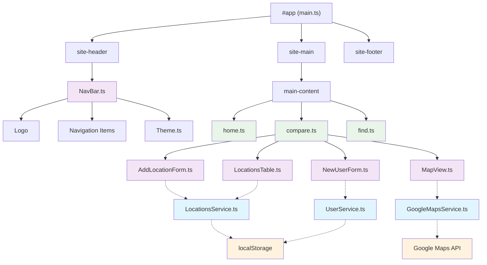
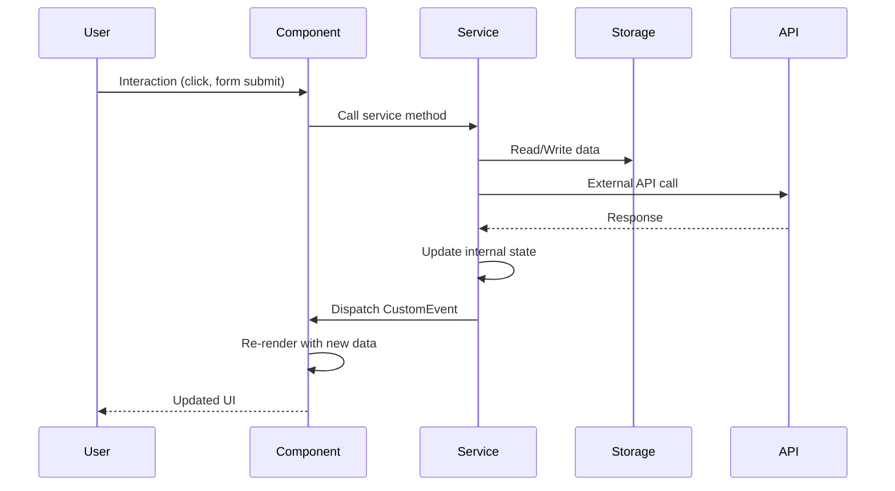

# Architecture Documentation

This document provides an overview of the Housing Hunt application architecture, component relationships, and data flow patterns.

## Component Tree

## Data Flow Architecture

## Event-Driven Communication

The application uses CustomEvents for loose coupling between services and components:

- `locationsUpdated` - Fired when LocationsService data changes
- `userUpdated` - Fired when UserService profile changes
- Theme changes propagated through CSS custom properties

## Routing System

Client-side routing handled by `router.ts`:

- Hash-based navigation
- Dynamic page rendering
- History API integration

## State Management

- **Services** maintain application state
- **localStorage** provides persistence
- **CustomEvents** notify UI components of changes
- **CSS Custom Properties** handle theming state
