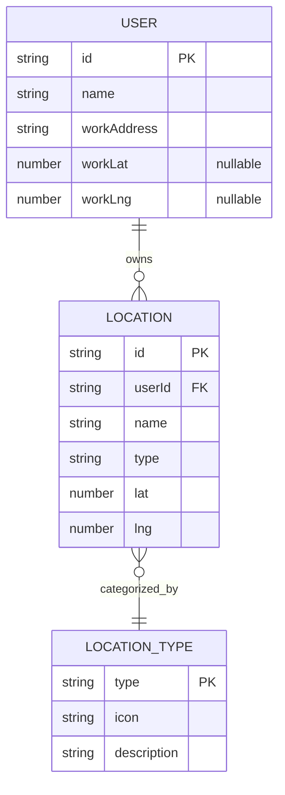
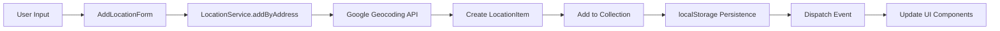

# Data Models and Entity Relationships

This document describes the data structures and relationships in the Housing Hunt application.

## Entity Relationship Diagram



## Data Models

### LocationItem

Represents a saved apartment or location of interest.

```typescript
interface LocationItem {
  id: string; // Unique identifier (UUID)
  userId: string; // References user who created it
  name: string; // Display name (e.g., "Downtown Apartment")
  type: string; // Category: walkup, highrise, work
  position: {
    lat: number; // Latitude coordinate
    lng: number; // Longitude coordinate
  };
}
```

**Constraints:**

- `id` must be unique across all locations
- `userId` links to current user session
- `position` coordinates must be valid lat/lng values
- `type` must match available marker types

### UserProfile

Stores user information and preferences.

```typescript
interface UserProfile {
  id: string; // Unique user identifier
  name: string; // User's display name
  workAddress: string; // Work location for commute calculations
  workCoords?: {
    // Geocoded work coordinates (optional)
    lat: number;
    lng: number;
  };
}
```

**Constraints:**

- `id` must be unique per browser/session
- `workCoords` populated after successful geocoding
- All fields persisted to localStorage

### LocationType

Defines available location categories.

```typescript
type LocationType = "walkup" | "highrise" | "work";

const MARKERCONS: Record<LocationType, string> = {
  walkup: "🏠", // Single-family homes, small buildings
  highrise: "🏢", // Large apartment complexes, towers
  work: "💼", // Work/office locations
};
```

## Data Storage

### localStorage Schema

```typescript
// User profile storage
"house_hunter_user": string // JSON.stringify(UserProfile)

// First-time user flag
"hasVisited": "yes" | null

// Theme preference
"theme": "light" | "dark"
"theme-timestamp": string // Date.now().toString()
```

### Seed Data

Initial locations loaded from `public/data/locations.json`:

```json
[
  {
    "id": 1,
    "type": "highrise",
    "name": "1 Superior Place",
    "position": { "lat": 41.895293, "lng": -87.628716 }
  },
  {
    "id": 2,
    "type": "work",
    "name": "Work",
    "position": { "lat": 41.894513, "lng": -87.622876 }
  }
]
```

## Data Flow

### Location Management



### User Profile Flow


## Data Validation

### Input Validation

- Location names must be non-empty strings
- Addresses validated through geocoding API
- Coordinates must be valid lat/lng ranges
- User names required for profile creation

### Error Handling

- Invalid addresses show user-friendly error messages
- Geocoding failures provide alternative suggestions
- Storage errors fallback to in-memory state
- Missing data handled with sensible defaults

## Future Enhancements

Potential data model extensions:

- Location ratings and reviews
- Commute time calculations
- Favorite locations
- Location sharing between users
- Price and amenity data
- Search filters and preferences
